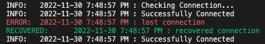

# NetworkMonitor

[](https://goreportcard.com/report/github.com/rekram1-node/NetworkMonitor) [](https://raw.githubusercontent.com/rekram1-node/NetworkMonitor/main/LICENSE) 

Simple Network Monitoring program, runs on any device, provides extensive customizability

Designed with ease of use and simple set up in mind

Low dependency solution (currently in progress)

Set up once and done, or turn off auto-updating in the [configuration](#configuration)



## Features

* [highly customizable](#configuration)
* [self updating](#configuration)
* [email status reports](#configuration)
* [track outages](#usage)
* [upload logs](#uploads)

## Installation

#### Docker
```shell
docker run rekram/network-monitor:latest
```

#### Binary Install

visit our [releases page](https://github.com/rekram1-node/NetworkMonitor/releases)

## Configuration

#### Initialization

Add the "-init" flag when running the application for the first time. All settings for this will be configured on initialization and can be edited in the configuration file during run. The app will initialize a new directory: "network-monitor" at root for your OS, and add the file: "config.yaml". While initializing you will be walked through a series of prompts to help you have a properly configured app

#### Uploads

The "config.yaml" file will contain a parameter called "uploadscripts" add your script and the script will be ran on a scheduled basis, this schedule will also be configured in the same file

## Usage

Start the monitor 

```shell
docker run rekram/network-monitor:latest
```

Run Upload Script 

```shell
docker run rekram/network-monitor:latest -upload
```

Initialize Monitor 

```shell
docker run rekram/network-monitor:latest -init
```
